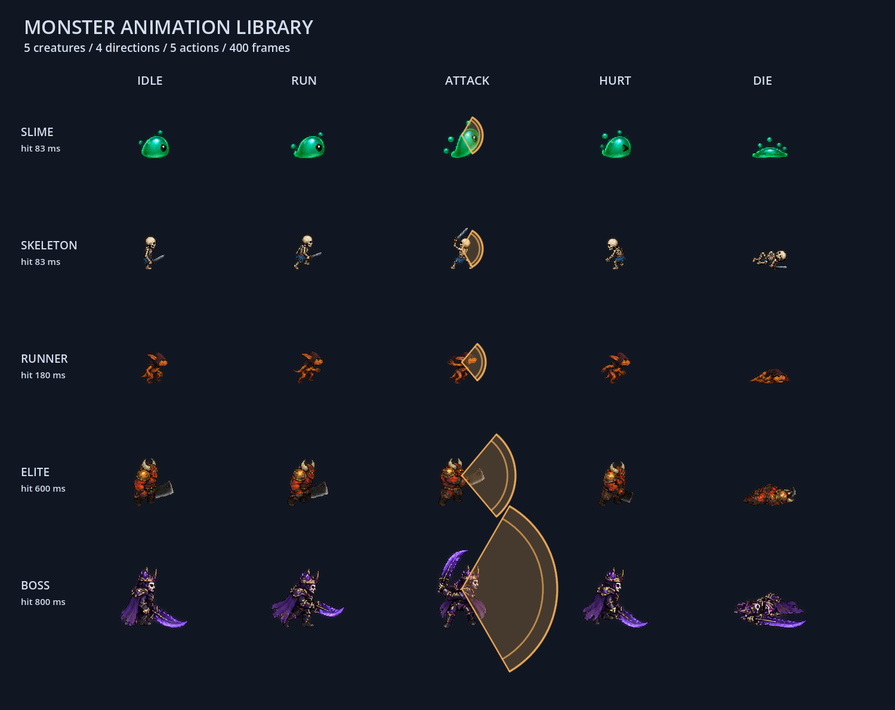

# 生存模式配置、动画与刷怪接入指南

更新日期：2026-09-11。只维护当前接口、规则和最近一次验收结论，不保留历史规则。具体数值见 [数值规则](SURVIVAL_BALANCE_DESIGN.md)。

## 1. 当前完成范围

| 项目 | 当前状态 |
| --- | --- |
| 实体、AI、攻击、奖励、生存JSON | 已配置；唯一源为 `json_config/`，同步到双端 |
| 服务端/客户端配置读取 | 已接入生存、奖励、怪物表现；奖励与生存的全部嵌套结构均为类型对象，读取返回隔离副本 |
| 五种怪物动画 | 已生成并接入，四方向×五状态×四帧，共400帧 |
| 攻击预警/出手/恢复 | 怪物按配置形状与毫秒时序显示；玩家1001/1004使用已有专用特效，其余攻击使用配置表现 |
| 怪物模板身份同步 | `EntityInfo.entity_config_key` 已贯通领域快照、Protobuf、EntityState和视图工厂 |
| 八阶段刷怪、经验、奖励执行器、结算 | 待实现；`SurvivalMode` 的主要生命周期与奖励处理仍为空 |

配置读取不自动执行刷怪或发奖。本次没有修改模式暂停机制和刷怪占位实现。

## 2. 配置维护与读取

只改 `json_config/*.json`，在仓库根目录运行：

```powershell
python -X utf8 -B tools/sync_config.py
```

`sync_config.py` 只复制文件，当前不执行配置内容校验。服务端根据 `config_loader.py` 自身路径定位 `server/config/`，与启动目录无关；启动时加载缓存。客户端首次访问从 `res://config/` 加载。修改配置后重启双端，不做运行中热更新。

`survival_config.json` 中同名字段的 `_同名字段` 中文注释仅在文件中首次出现时保留，后续阶段、怪物和池条目不重复说明；同名字段在不同位置的用途集中说明。有注释的对象分为上下两部分：上半部分集中放置注释，下半部分放置实际配置字段，中间用空行分隔；没有新注释的对象直接列字段。注释说明含义、单位、计算关系及尚未接入或停用的状态。双端加载器递归忽略这些注释键。

| 配置 | 用途 |
| --- | --- |
| entity_config.json | 基础能力、属性、AI编号、图集与逐帧区域路径 |
| ai_config.json | AI攻击距离、间隔与攻击ID |
| attack_config.json | 判定形状、绝对命中时刻、持续时间、冷却、伤害倍率和击退 |
| reward_config.json | 经验阈值、三选一、效果契约、击杀与固定礼包 |
| survival_config.json | 阶段、预算、人数、事件、出生与结束策略 |

服务端入口位于 `server/game/model/config_loader.py`：

```python
# coding=utf-8
from game.model import config_loader

survival = config_loader.get_survival_config()
stage = config_loader.get_survival_stage(1)
reward = config_loader.get_reward_config()
attack_up = config_loader.get_reward_definition("attack_up")
visual = config_loader.get_entity_visual_config("enemy_elite")

# 类型模型中的字段保持英文，阶段按1开始编号。
seconds = survival.duration_seconds
income_per_second = stage.normal_budget_per_minute / 60
next_xp = reward.progression.next_level_xp[0]
spawn_interval = survival.spawn.spawn_check_interval_seconds
elite_xp = reward.kill_rewards["enemy_elite"].xp
boss_event = config_loader.get_survival_stage(8).entry_spawn
```

双端配置类型逐层对应：服务端定义于 `server/game/model/balance_config.py`，客户端定义为 `ConfigLoader` 内部类。

| 配置层级 | 类型 |
| --- | --- |
| 奖励根对象 | RewardConfig |
| 经验、选择、效果规则 | RewardProgression、RewardChoice、RewardEffectRules |
| 奖励定义与效果 | RewardDefinition、RewardEffect |
| 击杀奖励、固定礼包、结算 | KillReward、RewardBundle、RewardSettlement |
| 生存根对象 | SurvivalConfig |
| 开局、人数、生成策略 | SurvivalRun、SurvivalMultiplayer、SurvivalSpawn |
| 特殊怪上限、阶段节奏 | SpecialAliveCaps、NormalStagePulse |
| 出生位置、回收规则 | SpawnPosition、SpawnRecycle |
| 怪物规则、定时与入口事件 | SurvivalEnemy、TimedSpawn、EntrySpawn |
| 阶段与普通池条目 | SurvivalStage、SpawnPoolEntry |

奖励、生存对象内部仅有 `rewards`、`kill_rewards`、`bundles`、`enemies` 四类按ID索引的字典，其值均是对应的类型对象。其他结构使用对象属性访问，不再使用 `progression["next_level_xp"]` 等字段字典访问。没有入口事件的阶段，`entry_spawn` 为 `None` / `null`；一次性奖励的 `max_stacks` 同样保留 `None` / `null`，不改用数字哨兵值。

服务端各层使用冻结dataclass，序列为tuple，整体读取通过deepcopy隔离ID索引容器。客户端各层使用RefCounted对象、类型数组和类型字典，通过显式 `copy()` 递归复制存储字段；`duration_seconds`是按阶段求和的计算属性。新配置在模式开始时读取一次并保存，不应每帧复制全表。

客户端示例：

```gdscript
var reward: ConfigLoader.RewardConfig = ConfigLoader.get_reward_config()
var survival: ConfigLoader.SurvivalConfig = ConfigLoader.get_survival_config()
var stage: ConfigLoader.SurvivalStage = ConfigLoader.get_survival_stage(1)
var elite_reward: ConfigLoader.KillReward = reward.kill_rewards["enemy_elite"]
var first_threshold: int = reward.progression.next_level_xp[0]
var check_interval: float = survival.spawn.spawn_check_interval_seconds
```

奖励/生存的四个读取入口在客户端返回对应类型对象；未知奖励、未知阶段报告错误并返回 `null`。服务端未知奖励/阶段抛出 `KeyError`。`get_entity_visual_config()`仍返回独立的表现配置字典，此次对象化范围是奖励与生存两张表。旧攻击/能力入口依旧返回共享配置对象，不得用于保存实例成长值。

双端加载只负责读取JSON、通过 `get(字段, 默认值)` 取值、必要的类型转换和对象构造。数字缺失取 `0` / `0.0`，布尔值缺失取 `false`，字符串缺失取空串，列表和索引表缺失取空集合；嵌套对象由空字典构造。可选的 `entry_spawn` 与 `max_stacks` 保留空值语义。`_` 开头字段递归忽略。

当前不检查经验阈值、效果操作、跨表引用、阶段数量与编号、池占比、节奏预算或特殊事件规则，也未把这些检查迁到同步脚本。JSON读取或解析失败仍报告基础错误，无法转换的字段类型可能在构造时自然报错；默认值只用于读取缺失字段，不表示配置满足玩法要求。

## 3. 动画资源与事件链

资源目录：`client/Prefab/Role/anim/monsters/`。五张原始透明PNG分别为slime、skeleton、runner、elite、boss，实际尺寸1122×1402。图片由内置 `image_gen` 生成，完整提示词保存在同目录 `generation_prompts.json`。

每张图按10行8帧排列：每种状态占两行，第一行Down/Right各4帧，第二行Up/Left各4帧；状态顺序Idle、Run、Attack、Hurt、Die。由于原图间距不均匀，运行时读取同名 `.atlas.json` 的80个精确区域，不能按宽高直接等分。各帧用统一画布、底部对齐，源PNG不重绘。

`MonsterAnimationLibrary` 构建并缓存SpriteFrames；`MonsterVisual`选择模板和缩放；`MonsterVisual.tscn`复用现有角色节点。元数据重建工具 `tools/build_monster_atlas.py` 只读取透明通道并生成裁切JSON，需要Pillow和NumPy；现有资源无需重新运行工具。阶段验收时检查实际渲染图及动作；常规改动只做静态检查和启动检查。

网络链路：

```text
Entity.entity_config_key
→ project_entity_snapshot
→ GameProtoProjector.entity_info
→ EntityInfo.entity_config_key（字段12）
→ EntityState.from_entity_info
→ EntityViewFactory → MonsterVisual
```

修改协议时只改 `protocol/game.proto`，执行项目同步脚本生成双端代码：

```powershell
$env:PYTHONDONTWRITEBYTECODE = '1'
.\tools\sync_proto.ps1 -GodotExecutable 'C:\work\godot\Godot_v4.6.3-stable_win64_console.exe'
```

收到 `AttackStart` 后，`CombatPresenter` 用权威攻击角度锁定身体方向，`AnimationPresenter`维持动作优先级，`MonsterVisual`按命中与恢复时刻切换帧。`ConfiguredAttackEffect`绘制同一配置的扇形/矩形预警与挥击。它不判定伤害。客户端移动更新不打断攻击，受击叠加颜色反馈，死亡清理特效且不再接收攻击播放；快照里已死亡的怪物直接进入死亡动作。

死亡四帧在模板666ms移除期限之前完成，尸体停留至服务端移除。未来攻速/范围奖励接入时，服务端实际判定与客户端预警必须使用同一缩放结果，并补充同步字段；当前奖励效果尚未执行。



## 4. 如何实现刷怪逻辑

主入口使用现有 `SurvivalMode`，每个世界保存自己的计时、阶段、预算和一次性事件状态。建议最小运行状态：`combat_elapsed`、`stage_index`、`initial_player_count`、各类型预算、上次生成检查时刻、类型轮换下标、已处理事件集合、待生成首领事件、结束原因。实例另外保存 `role`、`spawn_stage_id`、`spawn_event_id`、`reward_processed`。

当前 `GameWorld.step(dt)`、`GameMode` 与 `SurvivalMode` 的生命周期已接收dt，模式内的预算和刷怪仍在接入。生命周期事件列表返回值和调用方式尚需统一，再接入本帧有效玩法dt、实际推进标记和事件列表，并合并模式产出的出生/奖励/结算事件。不能在模式内猜固定30Hz或用server_tick代替玩法时间。

推荐帧顺序：

1. 首批玩家进入世界后开始一次模式，固定开局人数；空房间和已结束状态不刷怪。双人开始窗口/准备条件须与加入流程一起落实。
2. 执行本帧命令、AI、移动、攻击、死亡，再让模式消费已发生的伤害和死亡。先按配置优先级判断本帧胜负。
3. 只累积实际推进的玩法dt；暂停时预算和combat_elapsed都不动，选择超时使用独立时间。
4. 把dt按阶段边界和前/中/后节奏边界切段。处理阶段末经验、清预算、阶段进入动作，再按新阶段继续。
5. 处理跨过的精英时刻和唯一首领事件，记录已消费事件，避免连续tick重复触发。末帧未胜利则超时失败。
6. 帧尾创建新怪并把出生事件加入当前TickResult，新怪从下一tick参与AI。

普通预算循环：

```text
N = 固定开局人数
若普通存活数已达阶段上限×N：丢弃本步预算收入
否则逐个普通类型：
    share = 该类型budget_share / 当前池budget_share总和
    income = 阶段每分钟预算 / 60 × share × 当前节奏倍率 × N × 普通预算人数系数
    capacity = max(类型价格 × budget_carry_min_enemy_count, income × budget_carry_seconds)
    budget[type] = min(capacity, budget[type] + income × 有效dt)

每1秒检查：
    slots = min(3×N, 阶段上限×N - 当前普通存活数)
    轮换检查类型，只选择预算足够者
    找到有效位置 → 创建并设置实例属性 → 投影出生快照
    成功才扣该类型价格，立即扣slots并更新存活数
    找点失败保持有上限的预算，不在玩家脚下补怪
```

当前人数生成系数为1，所以每秒3×N是普通怪总量，不是每种类型各3×N；当前检查间隔为1秒，所以一轮也最多3×N只。若改短检查间隔，多轮检查仍须共享每秒额度；大dt不补发错过检查周期的整批名额。特殊怪独立于普通预算：精英达到上限或位置失败则跳过事件，首领位置失败在后续检查重试直至生成或结束。

`budget_carry_seconds` 限制可积压的收入量，不是生成间隔或余额过期时间。`budget_carry_min_enemy_count` 保证预算容量至少容纳指定数量该类型怪的价格，不直接增加余额。例如每秒收入0.1、单价2时，当前容量为 `max(0.1 × 5, 2 × 1) = 2`，不会因为5秒收入只有0.5就永远攒不够。两项预算封顶与生成间隔/数量限制尚待接入模式执行。

创建流程复用 `world.create_enemy(template, x, y)`，在投影之前修改实例 `CombatComponent.max_hp/hp/attack`并标记来源。属性按模板×出生阶段倍率计算；特殊怪HP再乘人数倍率，首领不乘阶段倍率。不得修改全局配置、先广播基础HP再改值，或对旧怪反复叠加阶段倍率。

## 5. 出生位置、奖励与后续验收

`SpawnPosition.spawn_distance_min_px` 与 `spawn_distance_max_px` 分别表示最小和最大世界距离，当前为64与160。选择一名玩家，在其圆环内采样，再要求候选点距离每名存活玩家都不少于最小值；最大距离只针对本次选中的中心玩家。位置计算不需要客户端视野尺寸或窗口缩放数据，允许在视野内生成。服务端模型、客户端对象字段、`copy()` 和双端 `get` 读取均使用这两个字段名。模式已有圆环采样和多人距离排除代码，尚未进行阶段验证；位置尝试次数仍写死为10，配置中的12及导航条件尚待接入。表中的 `require_outside_all_alive_views`、`minimum_approach_seconds` 为当前不使用的保留字段，已在对应注释中标明。

奖励执行器需要消费真实死亡事件，携带或保留怪物模板、阶段和事件来源，幂等发放经验/礼包。阶段清理与远距离回收不走击杀奖励路径。服务端保存玩家等级、XP、叠层、待选奖励与唯一选择编号；连续升级排队，单人选择暂停玩法，超时继续推进且重连不刷新。成长值用于实例计算，并同步给客户端显示和攻击预警。

下一步实施顺序：阶段1普通刷怪 → 八阶段/特殊怪 → 死亡经验与三选一 → 胜负重开 → 完整单人及双人平衡。各步重点验收暂停无积欠、死亡释放名额、特殊事件仅一次、实例倍率在出生前生效、奖励幂等、满级/重连/阶段边界、重开清空。

## 6. 当前检查记录与验证边界

按照用户约定，常规改动只做静态代码检查和项目启动检查；只有明确要求阶段验证时，才编写、更新并执行测试代码或进行功能实测、截图验收、双客户端联调。本次去除生存JSON中同名字段的重复注释，将不同位置的用途合并到首次说明，保持注释在上、字段在下，并同步双端副本与文档；不修改业务字段取值、玩法代码或加载逻辑。

环境：2026-09-11，Windows PowerShell；Python3.14.5；Godot4.6.3；使用现有server、client项目。

| 检查 | 状态 | 命令与证据 |
| --- | --- | --- |
| JSON静态语法 | 通过 | `python -X utf8 -B -` 内联使用 `json.loads()` 检查三份生存JSON语法；`json_static.log` |
| 差异格式检查 | 通过 | `git diff --check` 检查本次三份JSON与说明文档，无空白格式错误 |
| 服务端启动 | 失败 | 在server目录启动 `python -X utf8 -B -u main.py`；配置读取后监听127.0.0.1:8765，但第0帧在 `_budget_add()` 访问未初始化的 `_cur_stage.use_normal_stage_pulse` 时抛出 `AttributeError`；5秒后结束进程；`server_stderr.log` |
| Godot项目启动 | 通过 | Godot `--headless --path client --log-file D:/work2/godot_demo_v2/.tmp/survival_field_comments/client_startup_engine.log --quit-after 90` 退出0，无脚本解析/编译或场景加载阻塞；`client_startup.log` |
| 环境与退出告警 | 环境受限/待阶段检查 | 使用仓库内日志路径；系统证书及AppData插件注册仍受限，退出有资源占用告警 |
| 功能用例、动画实测、双客户端联调 | 未执行 | 本次未请求阶段验证；现有阶段验收脚本中的旧字典访问、构造函数参数及加载校验断言留到阶段验证时适配 |
| 完整生存局与奖励执行 | 未执行 | 间隔/上限、预算封顶、导航与事件、奖励结算尚未完整接入 |

详细日志位于 `.tmp/survival_field_comments/`。服务端当前阻塞位于本次未修改的 `server/game/systems/game_mode/survival_mode.py:122`：模式尚未初始化当前阶段就开始积累预算，游戏帧无法推进。本次仅记录，后续需在阶段初始化完成后执行预算更新，并在启动检查时确认游戏帧不再报错。字段注释描述目标规则和当前接入状态，不代表玩法已通过阶段验收。
