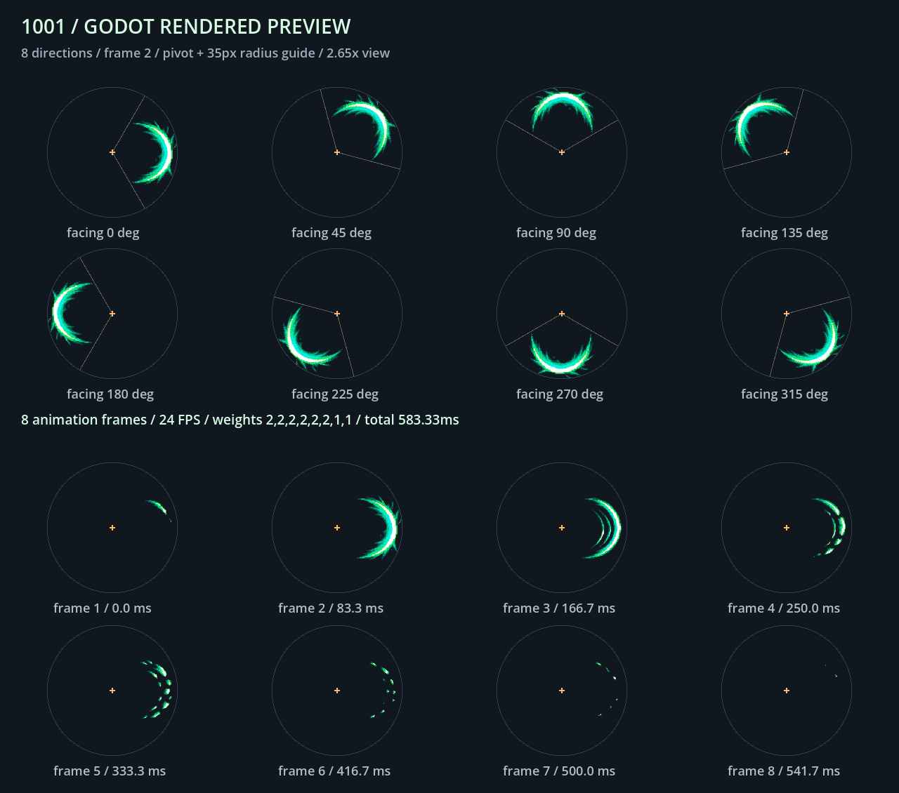

# 1001 独立攻击特效

使用内置 image_gen 生成的绿色、青绿和薄荷白像素风斩击序列。素材是无人物的独立刀光，基准朝向为右侧，由现有 CombatPresenter 按 -atk_facing 旋转。

- 场景：client/Prefab/Effect/AttackEffect_1001.tscn。
- 素材：client/Prefab/CommonTexture/VFX/Player_Attack_SectorSlashFX_1001.png。
- 原图尺寸：1774 × 887，RGBA，已验证真实透明像素；原始生成图直接复制，未重新绘制或修改像素。
- 切帧：4 列 × 2 行，按行读取；各帧 443 × 443；列起点 0、444、887、1331，行起点 0、444。
- 节奏：Attack 动画不循环，24 FPS；前 6 帧相对时长为 2，后 2 帧为 1，总时长约 583.33ms。第 2 帧是主要出刀画面，从约 83.33ms 开始。
- 枢轴：场景根节点放在攻击者中心；Scale 缩放为 0.092，沿本地右侧偏移 16.56px。以不透明度超过 50% 的主体刀光计算，最大半径约 34.94px，方位位于正前方约 ±57.18° 内，贴合 1001 的半径 35px、120° 扇形配置。
- 节点契约：保留 Scale/AnimatedSprite2D，首帧为 0，不设置自动播放；由 PlayerVisual.play_atk_effect 启动，并沿用其播放完成后释放的处理。
- 命中与伤害仍使用现有服务端配置；本资源仅负责表现，不修改 Body 动画、输入攻击 ID 或战斗协议。

## 验证结果

在无网络自动加载入口的隔离项目中使用 Godot 4.6.3 验证通过：实际 AttackEffectFactory 与 PlayerVisual 共创建并播放 10 个实例，覆盖八方向旋转、连续攻击、首帧重置、583.33ms 总时长、结束信号仅触发一次、节点释放与特效字典清空。源 PNG 含 1,388,668 个全透明像素。

八方向和逐帧预览由 Godot OpenGL 渲染器实际输出并目视核对：



## 最终采用素材的生成提示词

工具：内置 image_gen。以下保留原始提示词，便于后续生成同风格素材；实际输出尺寸和场景校准参数以上述记录为准。

```text
Use case: stylized-concept.
Asset type: production-ready transparent pixel-art VFX animation sprite sheet for a top-down Godot action game, attack 1001.
Create a standalone emerald-green and turquoise crescent sword slash, with pale mint highlight pixels, matching crisp small pixel-art RPG attack effects. EFFECT ONLY: no character, body, hand, sword, weapon, environment, text, numbers, borders, grid lines, watermark or cast shadow.
Canvas: 1024 x 512 pixels, true RGBA transparent background (alpha zero outside the effect, never a drawn checkerboard). Arrange EXACTLY eight animation frames in a perfectly regular 4-column by 2-row grid, each cell 256 x 256 pixels, no gaps or margins between cells. Reading order left to right, top then bottom. Every frame uses the same invisible pivot at the exact center of its cell (128,128). The attack points RIGHT (+X). All slash pixels lie on the RIGHT side of that pivot, in the sector spanning -60 to +60 degrees, approximately 100 pixels outer radius, with a generous transparent border. Shape resembles the right-facing ')' crescent edge of a 120-degree circular sector, NOT a full ring, not a beam, not a diagonal slash, and not a left-facing crescent. Keep pivot, scale, radius and direction identical across all cells. Use blocky pixel clusters, a small vivid palette, sharp stepped edges, no blur or soft glow.
Eight coherent frames of ONE slash: 1 a small faint anticipation streak along the upper right sector; 2 the bright full right-facing 120-degree crescent, the impact frame; 3 a slightly thinner complete crescent with two inner trailing arcs; 4 thinning crescent with broken lower tip; 5 breaking into short arc segments; 6 sparse mint/green fragments in the same sector; 7 very few tiny trailing green pixels; 8 nearly vanished, only two or three dim small pixels. Clearly decrease coverage and brightness after impact. This sheet is sliced programmatically into equal cells, so exact alignment and absolutely clean transparent empty space are essential.
```
